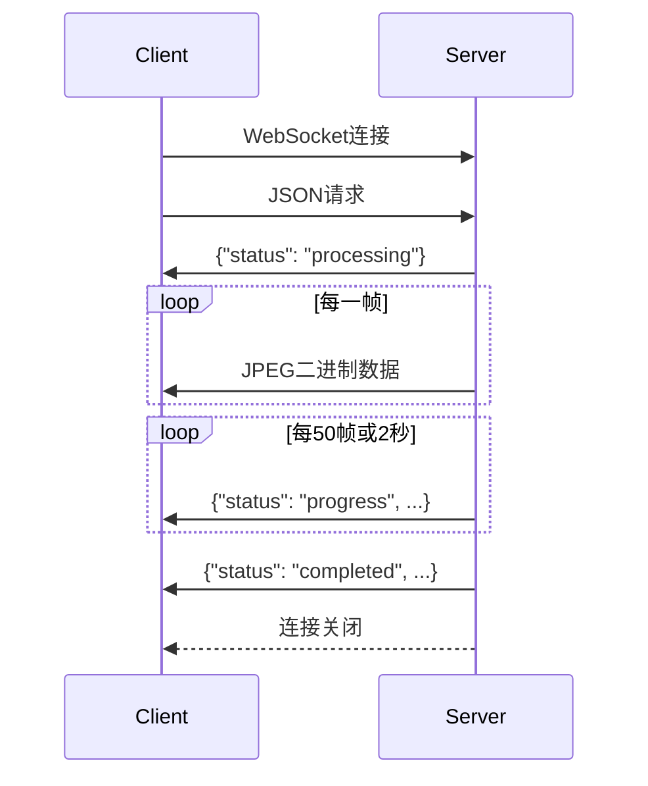

# MuseTalk WebSocket API 接口文档

## 🌐 连接信息

- **WebSocket地址**: `ws://localhost:8765`
- **协议**: WebSocket
- **数据格式**: JSON请求 + 二进制图片流响应

## 📤 请求格式

### 连接建立后发送JSON请求：

```json
{
    "audio_path": "/absolute/path/to/audio.wav",
    "options": {
        "jpeg_quality": 50,
        "batch_send": false,
        "verbose": false
    }
}
```

### 参数说明

| 参数 | 类型 | 必填 | 默认值 | 说明 |
|------|------|------|--------|------|
| `audio_path` | string | ✅ | - | 音频文件的绝对路径 |
| `options` | object | ❌ | {} | 可选配置项 |
| `options.jpeg_quality` | integer | ❌ | 70 | JPEG质量 (30-90)，越小文件越小速度越快 |
| `options.batch_send` | boolean | ❌ | false | 是否批量发送（建议false） |
| `options.verbose` | boolean | ❌ | false | 是否输出详细日志 |

## 📥 响应格式

### 1. 状态消息（JSON格式）

#### 开始处理
```json
{
    "status": "processing",
    "audio_path": "/path/to/audio.wav"
}
```

#### 进度更新（每50帧或每2秒）
```json
{
    "status": "progress",
    "current_frame": 150,
    "total_frames": 1500,
    "progress_percent": 10.0,
    "elapsed_time": 5.2
}
```

#### 处理完成
```json
{
    "status": "completed",
    "total_frames": 1500,
    "processing_time": 58.5,
    "fps": 25.6
}
```

#### 错误信息
```json
{
    "error": "音频文件不存在: /path/to/audio.wav"
}
```

### 2. 图片帧数据（二进制格式）

- **格式**: JPEG二进制数据
- **频率**: 实时流，每帧立即发送
- **大小**: 通常30-80KB/帧（取决于quality设置）
- **分辨率**: 根据原始视频尺寸而定

## 🔄 数据流时序



## 💡 使用示例

### JavaScript前端示例

```javascript
const ws = new WebSocket('ws://localhost:8765');

// 发送请求
ws.onopen = function() {
    const request = {
        audio_path: '/home/user/audio.wav',
        options: {
            jpeg_quality: 50
        }
    };
    ws.send(JSON.stringify(request));
};

// 接收响应
ws.onmessage = function(event) {
    if (typeof event.data === 'string') {
        // JSON状态消息
        const data = JSON.parse(event.data);
        
        if (data.status === 'progress') {
            console.log(`进度: ${data.progress_percent}%`);
        } else if (data.status === 'completed') {
            console.log('处理完成!');
        }
        
    } else {
        // 二进制图片数据
        const imageBlob = new Blob([event.data], {type: 'image/jpeg'});
        const imageUrl = URL.createObjectURL(imageBlob);
        
        // 显示图片
        const img = document.getElementById('avatar');
        img.src = imageUrl;
    }
};
```

### Python客户端示例

```python
import asyncio
import websockets
import json

async def test_client():
    uri = "ws://localhost:8765"
    
    async with websockets.connect(uri) as websocket:
        # 发送请求
        request = {
            "audio_path": "/home/user/audio.wav",
            "options": {"jpeg_quality": 50}
        }
        await websocket.send(json.dumps(request))
        
        frame_count = 0
        
        # 接收响应
        async for message in websocket:
            if isinstance(message, str):
                # JSON状态消息
                data = json.loads(message)
                if data.get("status") == "completed":
                    print(f"完成！共{frame_count}帧")
                    break
            else:
                # 二进制图片数据
                frame_count += 1
                with open(f"frame_{frame_count}.jpg", "wb") as f:
                    f.write(message)

asyncio.run(test_client())
```

## 📊 性能指标

| 指标 | 典型值 |
|------|--------|
| 处理速度 | 24-28帧/秒 |
| 帧大小 | 30-80KB (quality=50-70) |
| 延迟 | 实时流，无明显延迟 |
| 内存占用 | ~4GB GPU, ~2GB RAM |
| 支持时长 | 无限制（已测试1分钟+） |

## ⚠️ 注意事项

### 1. 文件路径
- 必须使用**绝对路径**
- 服务器必须能访问该路径
- 支持格式：.wav, .mp3等

### 2. 连接超时
- 长音频处理时间较长，连接会保持
- 自动心跳机制防止超时断连
- 建议客户端不设置过短超时

### 3. 质量设置建议
| 质量值 | 用途 | 文件大小 | 速度 |
|--------|------|----------|------|
| 30 | 极速预览 | ~30KB | 最快 |
| 50 | 实时应用 | ~45KB | 快 |
| 70 | 平衡模式 | ~65KB | 中等 |
| 90 | 高质量 | ~80KB | 较慢 |

### 4. 错误处理
- 连接断开：检查服务器状态
- 文件不存在：确认路径正确
- 内存不足：降低quality或重启服务

## 🔧 服务器启动

```bash
# 激活环境
source /home/paeleap/miniconda3/bin/activate MuseTalk

# 启动服务器
cd /home/paeleap/MuseTalk
python service/websocket_service.py
```

## 📞 技术支持

- **服务器状态检查**: `curl -i -N -H "Connection: Upgrade" -H "Upgrade: websocket" -H "Sec-WebSocket-Version: 13" -H "Sec-WebSocket-Key: test" http://localhost:8765/`
- **日志位置**: 控制台输出
- **GPU监控**: `nvidia-smi` 

# MuseTalk WebSocket API 使用说明

## 📝 概述
MuseTalk WebSocket 服务提供实时的数字人视频生成API。输入音频文件路径，实时输出JPEG格式的图片帧。

## 🔗 连接信息
- **服务器地址**: `ws://192.168.10.172:8765`
- **协议**: WebSocket
- **数据格式**: JSON消息 + 二进制JPEG帧

## 🚀 API 使用流程

### 1. 启动音频处理
**发送消息格式**:
```json
{
    "audio_path": "/absolute/path/to/audio/file.wav",
    "options": {
        "jpeg_quality": 70,     // 可选: JPEG质量 (10-95)，默认70
        "batch_send": false,    // 可选: 是否批量发送，默认false
        "verbose": true         // 可选: 是否显示详细日志，默认false
    }
}
```

### 2. 🛑 停止处理（新功能）
**发送停止指令**:
```json
{
    "action": "stop"
}
```

**停止功能说明**:
- 可以在处理过程中随时发送停止指令
- 服务器会立即停止生成图片帧
- 自动清理GPU显存为下一次处理腾出空间
- 返回停止确认消息

## 📨 服务器响应消息

### 状态消息（JSON格式）

#### 开始处理
```json
{
    "status": "processing",
    "audio_path": "/path/to/audio.wav"
}
```

#### 处理进度
```json
{
    "status": "progress",
    "current_frame": 150,
    "total_frames": 1500,
    "progress_percent": 10.0,
    "elapsed_time": 6.2
}
```

#### 正常完成
```json
{
    "status": "completed",
    "total_frames": 1500,
    "processing_time": 62.5,
    "fps": 24.0
}
```

#### 🛑 停止响应
收到停止指令时：
```json
{
    "status": "stopped",
    "message": "已停止处理并清理显存"
}
```

处理中途停止时：
```json
{
    "status": "stopped_mid_process",
    "message": "处理被停止，已生成 450 帧",
    "frames_generated": 450
}
```

#### 错误消息
```json
{
    "error": "错误描述信息"
}
```

### 图片帧数据（二进制格式）
- **格式**: JPEG二进制数据
- **大小**: 约30-80KB/帧（取决于JPEG质量设置）
- **分辨率**: 依赖输入图片，通常512x512或类似
- **发送频率**: 实时流式发送，约24-28帧/秒

## 📋 完整使用示例

### Python客户端示例
```python
import asyncio
import websockets
import json

async def test_with_stop():
    uri = "ws://192.168.10.172:8765"
    
    async with websockets.connect(uri) as websocket:
        # 1. 发送处理请求
        request = {
            "audio_path": "/home/user/audio.wav",
            "options": {"jpeg_quality": 70}
        }
        await websocket.send(json.dumps(request))
        
        frame_count = 0
        
        # 2. 监听响应
        async for message in websocket:
            try:
                # JSON状态消息
                data = json.loads(message)
                print(f"状态: {data}")
                
                # 根据需要发送停止指令
                if data.get('status') == 'progress' and data.get('current_frame', 0) > 100:
                    # 处理100帧后停止
                    await websocket.send(json.dumps({"action": "stop"}))
                    
            except json.JSONDecodeError:
                # 二进制图片帧
                frame_count += 1
                print(f"收到第 {frame_count} 帧")
                
                # 可以保存或处理图片数据
                # with open(f"frame_{frame_count}.jpg", "wb") as f:
                #     f.write(message)

# 运行测试
asyncio.run(test_with_stop())
```

### JavaScript客户端示例
```javascript
const ws = new WebSocket('ws://192.168.10.172:8765');

ws.onopen = function() {
    // 发送处理请求
    const request = {
        audio_path: '/home/user/audio.wav',
        options: { jpeg_quality: 70 }
    };
    ws.send(JSON.stringify(request));
};

ws.onmessage = function(event) {
    if (typeof event.data === 'string') {
        // JSON状态消息
        const data = JSON.parse(event.data);
        console.log('状态:', data);
        
        // 条件停止示例
        if (data.status === 'progress' && data.current_frame > 200) {
            ws.send(JSON.stringify({action: 'stop'}));
        }
    } else {
        // 二进制图片帧
        const blob = new Blob([event.data], {type: 'image/jpeg'});
        const imageUrl = URL.createObjectURL(blob);
        
        // 显示图片
        const img = document.createElement('img');
        img.src = imageUrl;
        document.body.appendChild(img);
    }
};

// 主动停止示例
function stopProcessing() {
    ws.send(JSON.stringify({action: 'stop'}));
}
```

## ⚡ 性能特点

- **处理速度**: 24-28帧/秒
- **延迟**: 低延迟实时流式输出
- **内存管理**: 自动GPU缓存清理（每500帧）
- **连接稳定**: 支持长时间连接（60秒心跳）
- **停止响应**: 即时停止，快速释放显存

## 🔧 参数说明

### jpeg_quality (JPEG质量)
- **范围**: 10-95
- **推荐值**: 70（平衡质量与速度）
- **影响**: 
  - 高质量(90+): 更清晰，但文件更大，处理更慢
  - 低质量(50-): 处理更快，文件更小，但画质下降

### batch_send (批量发送)
- **默认**: false（逐帧发送）
- **true**: 按批次发送，可能减少网络开销
- **false**: 实时逐帧发送，延迟更低

### verbose (详细日志)
- **默认**: false
- **true**: 显示详细处理日志
- **false**: 仅显示关键信息

## 🛡️ 错误处理

常见错误及解决方案：

1. **连接失败**: 检查服务器是否启动，IP地址是否正确
2. **音频文件不存在**: 确保提供绝对路径且文件存在
3. **GPU内存不足**: 发送停止指令释放显存，或降低batch_size
4. **网络超时**: 检查网络连接，服务器设置了60秒心跳超时

## 🎯 最佳实践

1. **实时应用**: 使用逐帧发送模式 (`batch_send: false`)
2. **质量平衡**: JPEG质量设置为70获得最佳速度与质量平衡
3. **长时间处理**: 监听进度消息，必要时发送停止指令
4. **资源管理**: 处理完成后断开连接，或发送停止指令释放显存
5. **错误处理**: 始终监听错误消息并适当处理

## 🧪 测试工具

使用提供的测试客户端：
```bash
cd /home/paeleap/MuseTalk/service
python test_client.py
```

测试功能：
- 自动连接和处理测试
- 实时显示处理进度
- **按 's' 键发送停止指令**
- **按 'q' 键退出程序** 